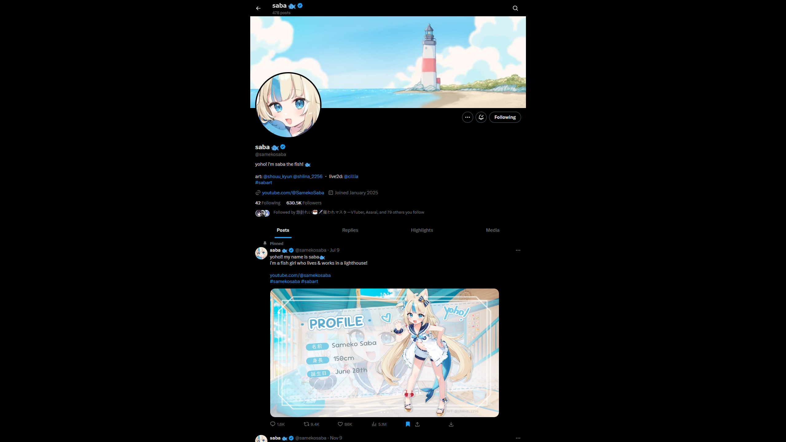

<h1 align="center"> Xcellent </h1>

Adjustable timeline width, hide ads, grok and other elements, show certain elements only on hover & more

> [!IMPORTANT]
> **For this installation link to work the stylus browser extension is necessary**
> 
> * **Chrome**: https://chromewebstore.google.com/detail/stylus/clngdbkpkpeebahjckkjfobafhncgmne
> * **Firefox**: https://addons.mozilla.org/en-US/firefox/addon/styl-us/ 

## Table of Contents
 1. [Preview](#preview)
 2. [Features](#features)
    * [Timeline](#timeline)
    * [Sidemenu ](#sidemenu-left)
    * [Sidebar](#sidebar-right)
    * [Customize](#customize)
    * [Other](#other)
 3. [Changelog](#changelog)

## Preview

https://github.com/user-attachments/assets/401436a7-c72b-4e5c-aa09-fb9f836e9d49

https://github.com/user-attachments/assets/7c46821c-e212-4a7a-adb3-c9d9bbd6fe46

## Features

### General
* Make use of full width instead of just the center on widescreen resolutions
* Hide grok stuff
* Works with all colors

> [!TIP]
> * Press **" g + d "** to quickly customize your view / color scheme on **X**
> * Press **" ? "** to see a list of all **X** keyboard shortcuts. There's a lot of useful ones!

### Timeline
* Adjust timeline width
* Stop timeline header scrolling along
* Hide "Who to follow" and/or Ads
* Hide various borders
  * Around timeline
  * Between posts
  * Around images
  * Around Quotes
* Fully rounded quote images

### Sidemenu (Left)
- Show only on hover
- Hide various links
  - Home
  - Explorer
  - Notifications
  - Chat
  - Premium
  - Lists
  - Bookmarks
  - Jobs
  - Communities
  - Verified Orgs
  - Profile
  - More
  - Post
### Sidebar (Right)
- Show only on hover
- Hide various elements
  - Searchbar
  - "You might like"
  - Trends
  - Legal notice

### Customize
- Custom background
  - Adjust brightness, size, position, scroll-behavior & repeat-behavior
- Custom logo

### Other

- Show messages only on hover
- Make ALL borders transparent

## Changelog

### 1.27.2
- add rule to settings.json to always display with tab size 8
- fix formatting for, hopefully, one last time

### 1.27.1
- adjust sidemenu left spacing slightly

### **1.27.0**
- add hide not-verified reminder option
- fix hide sidemenu messages/chat link option

### **1.26.0**
- adjust show-on-hover logic for bottom-right messages pop-up
- update minor cause I'm dumb an versions got messed up

### 1.25.1
- adjust some background/border colors rules

### **1.24.0**
- improve visuals when using a custom background
- adjust backgrounds for menus and modals
- fix especially the settings pages

### **1.23.0**
- unscuff settings pages
- add strong glass/aero-look for sidemenu, sidebar & messages
- make messages transparent (bottom-right) when using custom background or hover-messages
- Weak glass/aero-look for primary column (timeline etc.) when using custom background

### **1.22.0**
**Note**: This is especially useful for the / and g + u keyboard shortcuts
- make sidemenu, sidebar & message show when focused (keyboard controls)
- make messages retains its original width when using the hover/focus option

### 1.21.1
- add adjustments for custom background
- increment minor version instead of patch version for adding features

### **1.21.0**
- add option to set custom background
- improve hiding of sidemenu items (all of them can be hidden now)
- fix sidebar being iffy when scrolling down the timeline
- adjust timeline position on the left on smaller screen sizes
- hide adds on the right side when viewing media
- add changelog (as you can see)
